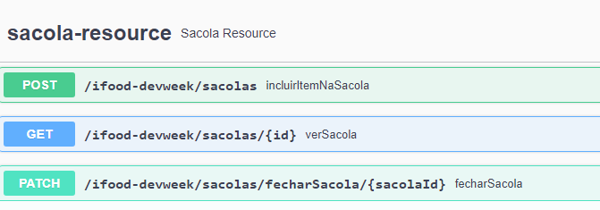

Restaurante API
Sacola API para Servir uma Aplicação com Domínio de Delivery

Slides dia 1 ♥ Slides dia 2 ♥ Slides dia 3 ♥ Slides dia 4

Status do Projeto
Sacola API 💻 Em construção...

Features
Incluir itens na sacola
Visualizar sacola
Fechar sacola
Excluir item da sacola
Demostração da Aplicação
Antes de começar, você precisará ter instalado em sua máquina as seguintes ferramentas:

Ferramenta	Versão
Java JDK	8+
Git	2.**
Gradle	7.**
Postman	9.**
** Visando facilitar a demostração da aplicação, recomendo instalar apenas o IntelliJ IDEA e rodar o projeto através da IDE **
No Terminal/Console:

Faça um clone do projeto na sua máquina: git clone https://github.com/cami-la/sacola-api.git
Entre na pasta raiz do projeto: cd sacola-api
Rode o comando: ./gradlew bootrun
Com a aplicação "de pé", clique aqui: http://localhost:8081/swagger-ui/
🚀 Collection Sacola API - Postman

Sacola API Swagger UI
Tecnologias Utilizadas
Dependência	Versão
spring initialzr	https://start.spring.io/
spring-boot-starter-web	2.7.4
spring-boot-starter-data-jpa	2.7.4
lombok	1.18.24
springfox-boot-starter	3.0.0
h2	2.1.214
Autor

Camila Cavalcante

Feito com ❤️ por Cami-la 👋🏽 Entre em contato!

Linkedin Badge Gmail Badge

Contribuindo
Este repositório foi criado para fins de estudo, então contribua com ele.
Se te ajudei de alguma forma, ficarei feliz em saber. E caso você conheça alguém que se identifique com o conteúdo, não deixe de compatilhar.

Se possível:

⭐️ Star o projeto

🐛 Encontrar e relatar issues